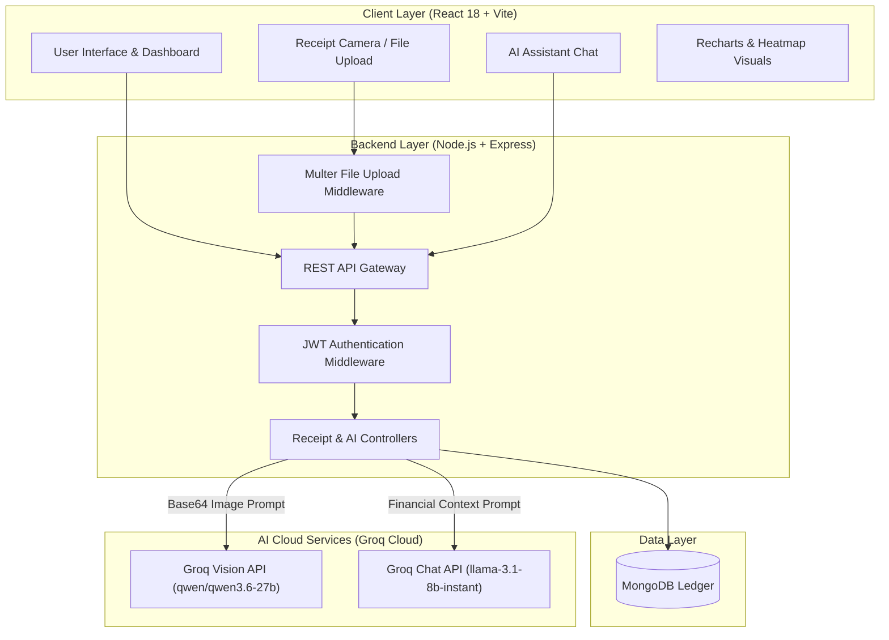
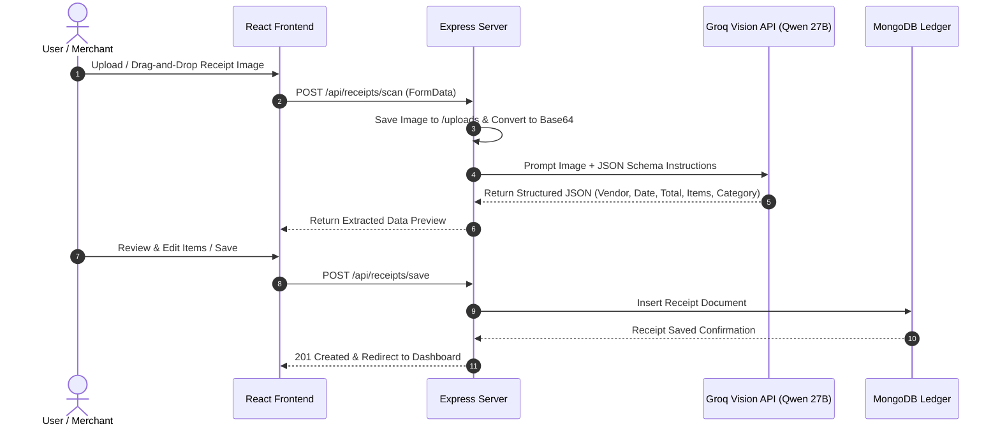
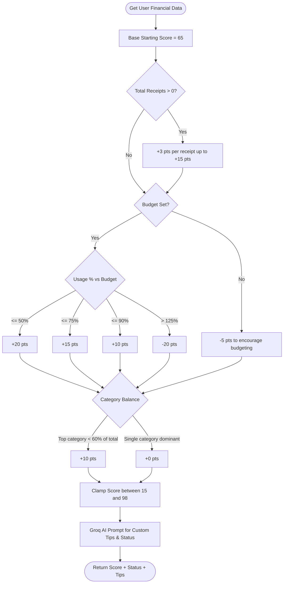

# 📸 KhataSnap AI
### Visual Receipt & AI Micro Business Ledger

[](https://nodejs.org/)
[](https://reactjs.org/)
[](https://vitejs.dev/)
[](https://groq.com/)
[](https://www.mongodb.com/)
[](LICENSE)

---

## 🌟 Executive Summary

**KhataSnap AI** is a production-grade, AI-powered expense management platform designed for micro-businesses, freelancers, and individuals. Instead of manually typing every receipt, users simply upload a photo or image of a paper receipt. KhataSnap AI leverages **Groq Cloud Vision AI (`qwen/qwen3.6-27b`)** to instantly parse, extract, itemize, and categorize expense items with high precision.

---

## 🎨 Modern SaaS Design System

The application features a modern Indigo SaaS aesthetic inspired by industry leaders like Stripe and Vercel:

| Swatch | Color Name | Hex Code | Purpose |
| :---: | :--- | :--- | :--- |
| 🟣 | **Electric Indigo** | `#4F46E5` | Primary brand accent, primary buttons, active tabs |
| 🔮 | **Vivid Violet** | `#7C3AED` | Secondary brand gradient, AI indicators, avatars |
| 🟢 | **Emerald Green** | `#10B981` | Positive progress, healthy budget scores, savings |
| ⬛ | **Deep Slate** | `#0F172A` | Hero banner backgrounds, high-contrast text |
| ⚪ | **Clean Slate** | `#F8FAFC` | Page canvas background with radial mesh lighting |

---

## 🏗️ System Architecture & Visual Data Flows

### 1. Overall System Architecture


---

### 2. Receipt Scanning & OCR Extraction Pipeline


---

### 3. Dynamic Financial Score Calculation Algorithm


---

## ⚡ Core Features Breakdown

### 1. 📷 Smart Receipt OCR & AI Extraction
- **Groq Vision AI (`qwen/qwen3.6-27b`)**: Scans receipt images and automatically extracts:
  - Vendor / Business Name
  - Transaction Date
  - Total, Subtotal, and Tax amounts
  - Itemized items (name, quantity, price)
  - Category classification (Groceries, Food, Transport, Medical, etc.)
  - Confidence Score (%)
- **Interactive Receipt Editor**: Review, edit, add tags, or adjust extracted line items before committing to the ledger.

### 2. 📊 Interactive Dashboard & Analytics
- **Stat Cards**: Real-time tracking of Total Expenses, This Month, Today's Spending, This Week, Receipt Count, Average Receipt, Top Vendor, and Top Category.
- **Monthly Line Chart**: 6-month continuous spending trend curve.
- **Spending by Category (Donut Chart)**: Visual breakdown of expense allocation.
- **Top Vendors (Bar Chart)**: Vertical bar breakdown of top merchant spending.
- **365-Day Spending Heatmap**: GitHub-style activity grid showing daily transaction intensity.

### 3. 🤖 AI Financial Advisor & Features
- **Dynamic Financial Score (0–100)**: Intelligently calculates score based on logging consistency, category balance, budget adherence, and month-over-month savings.
- **AI Financial Chat Assistant (`llama-3.1-8b-instant`)**: Ask questions about your spending in natural conversation (e.g., *"How much did I spend on groceries this month?"*).
- **Natural Language Smart Search**: Search receipts using plain queries like `"receipts over $50"` or `"grocery items last week"`.
- **Monthly AI Comparison**: Automated side-by-side analysis of month-over-month financial trends with custom recommendations.

---

## 🚀 Step-by-Step Installation Guide

### Prerequisites
Make sure you have the following installed on your machine:
- **Node.js**: v18.0.0 or higher
- **MongoDB**: Local MongoDB server or MongoDB Atlas connection string
- **Groq API Key**: Obtain a free API key from [Console.groq.com](https://console.groq.com/)

---

### Step 1: Clone the Repository
```bash
git clone https://github.com/MuhamadMahad00/KhataSnap-AI.git
cd KhataSnap-AI
```

---

### Step 2: Backend Configuration (`server/`)

1. Open a terminal and navigate to the `server` directory:
   ```bash
   cd server
   ```

2. Install dependencies:
   ```bash
   npm install
   ```

3. Create or edit the `.env` file inside the `server/` folder:
   ```env
   PORT=5000
   MONGO_URI=mongodb://localhost:27017/khatasnap
   JWT_SECRET=khatasnap_production_secret_key_2026

   # Groq API Keys (Can use the same key for all three if desired)
   GROQ_API_KEY_VISION=your_groq_api_key_here
   GROQ_API_KEY_CHAT=your_groq_api_key_here
   GROQ_API_KEY_INSIGHTS=your_groq_api_key_here

   # Supported Vision & Chat Models
   GROQ_VISION_MODEL=qwen/qwen3.6-27b
   GROQ_CHAT_MODEL=llama-3.1-8b-instant
   ```

4. Start the backend server:
   ```bash
   npm start
   # Or for development mode with auto-reload:
   npm run dev
   ```
   *The server should run on `http://localhost:5000` with MongoDB connected.*

---

### Step 3: Frontend Configuration (`client/`)

1. Open a new terminal window and navigate to the `client` directory:
   ```bash
   cd client
   ```

2. Install dependencies:
   ```bash
   npm install
   ```

3. Start the Vite development server:
   ```bash
   npm run dev
   ```
   *The frontend application will launch at `http://localhost:5173`.*

---

### Step 4: (Optional) Seed / Update Receipt Dates

To populate the Dashboard analytics, heatmap, and line charts with sample data for testing:

```bash
cd server
node fix_dates.js
```

---

## 📡 API Endpoint Reference

### 🔐 Authentication (`/api/auth`)
| Method | Endpoint | Description |
| :--- | :--- | :--- |
| `POST` | `/api/auth/register` | Register a new user account |
| `POST` | `/api/auth/login` | Authenticate user & receive JWT token |
| `GET` | `/api/auth/me` | Fetch currently authenticated profile |

### 📄 Receipts (`/api/receipts`)
| Method | Endpoint | Description |
| :--- | :--- | :--- |
| `POST` | `/api/receipts/scan` | Upload image & parse with Groq AI (`qwen/qwen3.6-27b`) |
| `POST` | `/api/receipts/save` | Save reviewed receipt to database |
| `GET` | `/api/receipts` | Fetch all user receipts (with filters) |
| `GET` | `/api/receipts/stats` | Fetch aggregated dashboard statistics |
| `GET` | `/api/receipts/heatmap` | Fetch 365-day spending heatmap data |
| `DELETE`| `/api/receipts/:id` | Delete a saved receipt |

### 🤖 AI Features (`/api/ai`)
| Method | Endpoint | Description |
| :--- | :--- | :--- |
| `POST` | `/api/ai/chat` | Send prompt to AI Financial Assistant |
| `POST` | `/api/ai/smart-search` | Convert natural query to MongoDB search |
| `GET` | `/api/ai/financial-score` | Calculate dynamic score (0-100) & tips |
| `GET` | `/api/ai/insights` | Fetch automated monthly AI financial insights |
| `GET` | `/api/ai/monthly-comparison` | Fetch month-over-month spending comparison |

---

## 🧪 Testing the Application

1. **Upload Testing**:
   - Go to the **Upload Receipt** page (`http://localhost:5173/upload`).
   - Click **🧪 Try Sample Receipt** to test the Groq AI vision extraction instantly without uploading your own file.
2. **AI Chat Assistant**:
   - Click the floating chat button in the bottom right corner.
   - Ask: *"How much did I spend this month?"* or *"What is my top spending category?"*

---

## 🛡️ Security & Best Practices

- **JWT Authentication**: Secure stateless token validation on protected routes.
- **Input Sanitation**: Sanitized queries and structured JSON verification for AI model responses.
- **Environment Protection**: Private API keys and secrets stored exclusively in `.env`.

---

## 📝 License

Distributed under the MIT License. See `LICENSE` for more information.

---

<div align="center">
  <sub>Built with ❤️ for smart expense management and financial intelligence.</sub>
</div>
